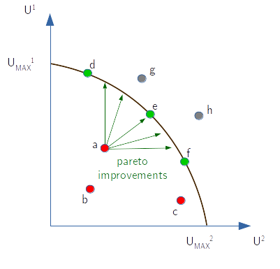

# [Basic concepts](@id basic_concepts)

In this unit we will introduce the main terminology, the concepts of Mixed strategies and equilibrium, in particular the Nash equilibrium.

As we will use Julia to explain the concepts, let's first set up some stuff, like working on a environment specific for these notes instead of using a global environment. We'll do this at the beginning of each chapter. If you need help in setting up or using Julia you can refer to my tutorial [here](https://syl1.gitbook.io/julia-language-a-concise-tutorial/).

```julia
using Pkg 
using Test # hide
cd(@__DIR__)
Pkg.activate(".")
# And let's install the companion package "StrategicGames" from https://github.com/sylvaticus/StrategicGames.jl
Pkg.add("StrategicGames")
using LinearAlgebra, StrategicGames
```

## Basic definitions

**Utility** function:
- a mapping from a certain state of the world to a real number interpreted as measure of agent's happiness or satisfation
- it allows quantify preferences against different alternatives
- strictly speaking utility is an _ordinal_ measure, not a _cardinal_ one. When we apply an affine transformation (i.e. linear with eventually a constant, like $y = ax+c$) to the inputs of the utility function the _ranking_ of the preferences doesn't change. As well the comparition of utilities between different agents doesn't change (if the utility of agent 1 was higher than those of agent 2 and we apply an affine transformation to the inputs, e.g. we change the measure units, the utility of agent 1 remains higher than those of agent 2).

**Game** :
- the situation arising from the interaction of multiple utility maximising agents 

**Noncooperative** game:
- when the modelling unit is the (utility maximising) individual

**Coalitional** or **cooperative** games:
- when the modelling unit is the group

**Normal form game**:
- a game situation where each players play at the same time (no time dimension) and states of the word (utilities) depends only from the combined actions of all the players, without stochasticity (there could still be stochasticity in the choice of making decisions by the players)

**Bayesian game**:
- when the state of the world depends on stochasticity other than the players combined actions

**Extensive-form games**:
- include a timing dimension _t_ that precises the _order_ of the actions taken by the various players
- it becomes relevant the degree of information that the agents know at the times of making decisions  
 
A (_finite, N-person_) **normal-form** game is characterized by the following elements:
- $N$ is a finite (ordered) set of players indexed by $n$
- $A_n$ is the (ordered) set of actions available to player $n$. Each player can have different actions available (including in different number). The total possible states of the world correspond to all the possible actions that all the $N$ players can take and it is given by the _N_-dimensional array $A$ of size $(length(A_1),length(A_2),...,length(A_n)$. Note that as there isn't any stocasticity here, there is no distintion between a given set of actions and the resulting state of the world.
- $U$ is the utility levels associated to each corresponding state of the word, aka **pay-off matrix** ("array" would be a more appropriate word). This is a $N+1$ dimensional array of size $(length(A_1),length(A_2),...,length(A_n),N$. The last dimension has size $N$, as each player has its own utility functions of the various states of the world. Alternatively, $U$ can be represented as a N dimensional array of tuples representing each the utility of the various players for the given state of the world.

!!! tip
    The `StrategicGames` package has a convenient function `expand_dimensions(A)` to pass from a _N_ dimensional array of tuples in a _N+1_ dimensional array of scalars
  
We can further define:
- $S_n$ the (infinite) set of all the discrete probability functions that agent $n$ may want to use over its set of available actions $A_n$ in order to stocastically determine its action. Each individual probability distribution $s_{ni}$ is called **strategy**. Strategies $s_{ni}$ with a single action with non-zero probabilities are called **pure strategies**, while strategies with more than one available action assigned non-zero probabilities are called **mixed strategies** and strategies with non zero probabilities for all actions are named **fully mixed straegies**. The (sub)set of actions assigned non-zero probabilities is called **support** of the given strategy. We indicate with $s_{n}$ the strategy (PDF) emploied by player $n$ and with $s$ the **strategy profile**, the set of all particular strategies applied by all the individual players.
- $a_{length(A_1),length(A_2),...,length(A_n)}$ are the individual states of the world (the elements of the $A$ array) derived by the combined actions of all the $1,2,...,N$ players. These are also called an _action profile_.
- $E[U(s_{ni})]$ The _expected_ utility by player $n$ by employing strategy $s_{ni}$. Knowing (or assuming) the strategies emploied by the other players, the expected utility of a given strategy $i$ for player $n$ can be computed as $\sum_{a \in A} U_n(a) \prod_{j=1}^{N} s_j(a)$ that is it, for each state of the world $a$ we compute the probability (using the multiplication rule) that it arises using the strategies of all the players, _including the one specific we are evaluating ($i$ of player $n$)_, and we multiply it by the utility this state provides to player $n$ and we finally sum all this "possible" state to retrieve the expected value. 

### Interpretation of mixed-strategies equilibrium

What does a mixed-strategy represents? Why should it be used ?

1. Confuse the opponent. In many competitive games (like the _Head or Tail_ one) apply a pure strategy would imply the other player be able to exploit to its own advantage. It is only by applying a random (i.e. mixed) strategy that the opponent can't exploit your strategy
2. Uncertainty over other players' strategies. Under this interpretation, a mixed strategy of a given player is the assessment of all other players concerning how likely are his pure strategies taken individually. Further, every action in the support of a mixed strategy in a Nash equilibrium is a best response to the player beliefs about the other players’ strategies. 
3. Empirical frequency. The entry of each action in a mixed strategy is the relative count on how often that action would be emploied in repeated games by the same players or with a different players selected at random from a hypothetical "player population"


### Examples

```julia
N = 3            # 3 players
A = [3,2,2]      # 3, 2,and 2 actions available for players 1,2,3 respectively
U = rand(A...,N) # pay-off array
a = (2,1,2)      # one particular state of the world (action profile)
U[a...,2]        # The utility for player 2 associated to this particular state of the world - note that we select "2" on the last dimension

s1 = [0.5,0.3,0.2] # One particular mixed-strategy emploied by player 1
s2 = [0,1]         # One particular pure-strategy emploied by player 2
s3 = [0.5,0.5]     # One particular mixed-strategy emploied by partner 3

s = [s1,s2,s3]     # A strategy profile

# Expected utilities for the 3 players under strategy profile s:
expected_utility = [sum(U[i1,i2,i3,n] * s[1][i1] * s[2][i2] * s[3][i3] for i1 in 1:A[1], i2 in 1:A[2], i3 in 1:A[3]) for n in 1:N]
expected_utility = StrategicGames.expected_payoff(U,s) # equivalent from the library package

```


### Particular types of games

**Common-playoff** games:
- a type of game where, for each action profile, all players derive the same utility 
- a "pure coordination" game: the players have no conflict interest and the only "difficulty" is for them to coordinate to get the maximum benefits

**Zero-sum** games (aka "**constant-sum**" games):
- a 2-players type of game where the sum of the utility for the 2 players for each action profile is constant
- a "pure competition" game, as if one action profile bring some additional advantage than the constant for the first player, this must be at the expenses of the other player 
- as games are insensible to affine transformations, this constant isn't restricted to be zero, it can be any constant value

**Prisoner-dilemma** games:
- a classical 2-actions, 2-players game with:
-  a pay-off structure like:

  | p1 \ p2 | A     | B     |
  | ------- | ----- | ----- |
  | A       | a,a   | b,c   |
  | B       | c,b   | d,d   |

  where the first element in the tuple of each action profile (cell) represents the utility for player 1 (row player) and the second element the utility for player 2 (column player)
- a numerical evaluation of $a,b,c,d$ such that $c > a$, $d > b$ and $a > d$, that is $c > a > d > b$

This game is partially cooperative and partially competitive. It can be seen that for each player, whatever the other player playes, it is always better to play `B` (for example for player 1, if player 2 plays `A`, $c$ is higher than $a$, and if player 2 plays `B`, $d$ is higher than $b$).
The action `B` then _dominates_ the other one for both the players even if they could coordinate they would be both better off by both choosing `A`.
In other words, as everyone behaves as _free rider_, the best feasible state is never reached. This is a frequent situation in economics in relation to the production of public goods: everyone wants to share the benefit from it, but nobody wants to bring the costs of their production.

The name derives from the original situation used to illustrate the case, of two prigioniers that can choose to deny their common crime they are accused (A) or confess to the authority (B), where if one alone confesses, he get free of prison ($c$) but the other get a harsh prison term ($b$); if both confess they get a standard prison term (d) and if they both deny they got a mild prison term ($a$). The outcome of the game is that it is rational for both of them to confess !

### Examples

A common pay-off game with 2 actions for the first player and 3 actions for the second player:

| p1 \ p2 | A     | B     | C    |
| ------- | ----- | ----- | ---- |
| A       | 1,1   |  2,2  | 3,3  |      
| B       | 4,4   |  5,5  | 6,6  |   

A constant-sum pay-off  game with 2 actions for the first player and 3 actions for the second player:

| p1 \ p2 | A     | B     | C     |
| ------- | ----- | ----- | ----- |
| A       | 1,3   | 5,2   | 3,1   |      
| B       | 4,0   | 5,-1  | 6,-2  |  

A prisoner-dilemma problem:

| p1 \ p2 | Deny  | Confess |
| ------- | ----- | ------- | 
| Deny    | -1,-1 |  -3,0   |       
| Confess |  0,-3 |  -2,-2  | 


## Pareto optimality of a state of the world

When we put ourself as an outside observer we would like a criteria to decide which outomes are better than others. Under the pareto optimal criteria (bear in mind that economists prefer to use the word "efficient" rather than "optimal") a given strategy profile is optimal if there could not be a player that could be made better off from the resulting (expected) state of the world without another player being made worst, that is there are no pareto-dominated strategy profile where at least one player could improve its expected utility without the other loose anything under another strategy profile.

Pareto efficient solutions are not unique. They form instead a "frontier" of the utilities that the game can bring to the players.

In the figure below the two axis refer to the expected utilities for players 1 and 2, red points ($a,b,c$) refer to Pareto dominated strategy profiles; green points $d,e,f$, leaning on the efficient frontier, are Pareto optimal strategies and grey points $g,h$ are simply points impossible to obtain in the given game.   



### Example

The following table provides the expected utility for a 3-players game, each with two pure actions, and show which of them are on the frontier on the last column:

| Str. profile | Player1 | Player 2 | Player 3 | Optimal |
| ------------ | ------- | -------- | -------- | ------- |
| A,D,F        | 6       | 4        | 10       |         |
| A,D,G        | 2       | 14       | 5        | *       |
| A,E,F        | 4       | 4        | 4        |         |
| A,E,G        | 8       | 8        | 8        | *       |
| B,D,F        | 4       | 12       | 5        | *       |
| B,D,G        | 7       | 8        | 1        |         |
| B,E,F        | 12      | 2        | 1        | *       |
| B,E,G        | 6       | 6        | 10       | *       |

We can see that this game has 5 Pareto-optimal strategy profiles. The $(A,D,F)$ strategy is instead dominated by the $(B,E,G)$ one, the $(A,E,F)$ strategy is dominated by the $(A,D,F)$, $(A,E,G)$, $(B,D,F)$ and $(B,E,G)$ ones and finally the $(B,D,G)$ strategy is dominated by the $(A,E,G)$ one.

The prisoner-dilemma is an interesting example of how the equilibrium outcome (confess, confess) is the only Pareto-dominated outcome of the game. 
